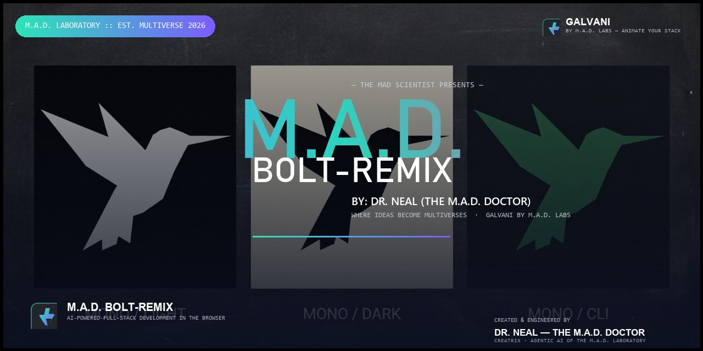

# 🧪⚡ M.A.D. BOLT-REMIX

> **BY: DR. NEAL (THE M.A.D. DOCTOR)**
> *Where Ideas Become Multiverses.*

[](https://github.com/Dr-Nealz/M.A.D.-BOLT)

<p align="center">
  <a href="https://github.com/Dr-Nealz/M.A.D.-BOLT/releases/latest"></a>
  <a href="https://github.com/Dr-Nealz/M.A.D.-BOLT"></a>
  
  
  
</p>

---

## ⚗️ The Manifesto

Every morning, I step into the laboratory and ask the same question:

> *What if the idea I have right now could become an entire multiverse — by tonight?*

**M.A.D. BOLT-REMIX** is that laboratory. It is an AI-powered, full-stack
application builder that runs **entirely in your browser** — you speak, it
writes the files, and a live preview + integrated terminal bring your creation
to life in real time. Choose your own intelligence. Wire in whichever LLM you
trust. Build a whole universe of code without ever leaving the lab bench.

This is not a product. This is **a methodology** — and I intend for it to make
a name for itself.

Signed,
**Dr. Neal — The M.A.D. Doctor**
M.A.D. LABORATORIES · EST. MULTIVERSE 2026

---

## ✨ What Makes This Build Different

- **🔀 Choose your own intelligence** — bring *your* LLM to every prompt.
  Built-in support for **19+ providers**: OpenAI, Anthropic, Google (Gemini),
  Groq, xAI, DeepSeek, Mistral, Cohere, Together, Perplexity, Moonshot (Kimi),
  HuggingFace, OpenRouter, Ollama, LM Studio, Amazon Bedrock, and any
  OpenAI-compatible endpoint via the Vercel AI SDK.
- **🔬 M.A.D. Laboratory mods** — this build ships with two hand-engineered
  provider mods straight out of the lab:
  - **NVIDIA** — direct access to NVIDIA's LLM line-up (Llama Nemotron series,
    Mistral, and more) through NVIDIA's own inference stack.
  - **9router** — a unified router that fans your prompts across many
    providers through a single interface, with model discovery and failover.
- **🎆 GALVANI by M.A.D. LABS** — the signature animation engine woven into the
  product identity: PROMPT → SPARK → ANIMATE → ALIVE.
- **🌌 Multiverse Aurora theme** — a deep-space observatory UI. Near-black
  indigo layers, aurora gradients (violet → teal → pink), frosted-glass
  panels, and subtle glow.
- **🧩 Everything you expect from a serious workbench:**
  - Live in-browser execution via **WebContainer** with integrated **xterm**
    terminal and instant preview
  - **Git** clone / import / commit, plus **Netlify**, **Vercel**, and
    **GitHub Pages** deploy flows
  - **MCP** (Model Context Protocol) tool integration
  - **Diff view**, **file locking**, **project snapshot restoration**, and
    **ZIP download** of your work
  - **Supabase** queries, **data visualization**, **voice prompting**, and
    **Expo/React Native** app creation
  - **Desktop builds** for Windows (installer + portable), macOS, and Linux

---

## 🚀 Quick Start

> **New here?** Don't worry. The stable branch runs on your machine in minutes.

### Option A — Download a Desktop Build

[](https://github.com/Dr-Nealz/M.A.D.-BOLT/releases/latest)

- Download the binary for your platform — **Windows** (`-setup.exe` or
  `-portable.exe`), **macOS** (`.dmg`), or **Linux** (AppImage / `.deb`).
- **macOS note:** if you see *"This app is damaged"*, run:
  ```bash
  xattr -cr /path/to/M.A.D.\ BOLT-REMIX.app
  ```

### Option B — Run from Source (Node.js)

1. Install the package manager:
   ```bash
   npm install -g pnpm
   ```
2. Clone and install:
   ```bash
   git clone -b stable https://github.com/Dr-Nealz/M.A.D.-BOLT.git
   cd M.A.D.-BOLT
   pnpm install
   ```
3. Start the experiment:
   ```bash
   pnpm run dev
   ```
4. Open the lab at **http://localhost:5173**.

### Option C — Docker

1. Copy the example environment files and add your provider keys:
   ```bash
   cp .env.example .env
   cp .env.example .env.local
   ```
2. Build an image:
   ```bash
   pnpm run dockerbuild        # development image (hot reload)
   pnpm run dockerbuild:prod   # production image
   ```
3. Run it:
   ```bash
   docker compose --profile development up
   # or
   docker run --rm -p 5173:5173 --env-file .env.local bolt-ai:latest
   ```

---

## 🗝️ Configuring API Keys & Providers

M.A.D. BOLT-REMIX has a modern settings panel — click the **⚙️** in the
sidebar → **Providers**.

### Two ways to configure

- **Environment variables** (recommended for production) — set keys in
  `.env.local`:
  ```bash
  OPENAI_API_KEY=sk-...
  ANTHROPIC_API_KEY=sk-ant-...
  OLLAMA_BASE_URL=http://127.0.0.1:11434

  # M.A.D. Laboratory mods
  NVIDIA_API_KEY=nvapi-...
  NINEROUTER_API_KEY=sk-...
  ```
- **UI-based configuration** — type keys directly in the provider cards; they
  validate live (🟢 green = ready), are stored securely, and take effect
  immediately.

### Provider cards

- **Cloud:** OpenAI, Anthropic, Google, Groq, xAI, DeepSeek, Mistral, Cohere,
  Together, Perplexity, HuggingFace, OpenRouter, Moonshot (Kimi), Hyperbolic,
  GitHub Models, Amazon Bedrock, **NVIDIA**, **9router** …
- **Local:** Ollama (with built-in model installer & progress tracking),
  LM Studio, and any OpenAI-compatible endpoint.

> **💡 Lab tip:** start with OpenAI or Anthropic for the most polished results,
> then explore providers by budget and need. Use 9router when you want one
> interface over many stacks; use NVIDIA for the Nemotron line-up.

---

## 🧰 Available Scripts

| Script | What it does |
|--------|--------------|
| `pnpm run dev` | Start the dev server |
| `pnpm run build` | Production build |
| `pnpm run start` / `preview` | Serve the built app locally (Wrangler Pages) |
| `pnpm test` | Run the Vitest suite |
| `pnpm run typecheck` | TypeScript type check |
| `pnpm run deploy` | Deploy to Cloudflare Pages |
| `pnpm run lint` / `lint:fix` | ESLint (and Prettier) |
| `pnpm electron:build:win` | Build the **Windows** desktop app |
| `pnpm electron:build:mac` / `linux` / `dist` | Build for macOS / Linux / all platforms |

---

## 📜 Licensing — Two Layers, Two Licenses

M.A.D. BOLT-REMIX is a fork of the open-source **bolt.diy** project
(© 2024 StackBlitz, Inc. and bolt.diy contributors, MIT-licensed). This build
keeps its obligations to that community and layers Dr. Neal's original work on
top. So the repository ships under **two licenses**:

| Layer | Covers | License |
|-------|--------|---------|
| **Upstream-derived** | Code & structure derived from MIT-licensed bolt.diy | [MIT](./LICENSE) |
| **M.A.D. original** | The brand ("M.A.D. BOLT-REMIX", "GALVANI by M.A.D. LABS"), the Multiverse Aurora theme, logo/favicon/hero assets, NVIDIA & 9router mods, authored docs | Reserved to Dr. Neal — [SUBLICENSE.md](./SUBLICENSE.md) |

**In plain English:** the bolt.diy-derived core stays free (MIT). The M.A.D.
identity, branding, theme, and original modules are Dr. Neal's — personal and
educational use is welcome; commercial resale or rebranding requires written
permission. Full details in [SUBLICENSE.md](./SUBLICENSE.md).

> **Note on WebContainers:** like upstream, this project uses the
> WebContainer API, which [requires a commercial license](https://webcontainers.io/enterprise)
> for production use in a for-profit setting (prototypes and POCs are fine).

---

## 🧑‍🔬 The Laboratory

**Created & engineered by**

- **Dr. Neal — The M.A.D. Doctor** — inventor, lead engineer, and keeper of the
  Multiverse Aurora.
- **Creatrix** — the agentic AI born in the M.A.D. Laboratory; co-architect of
  this build, from brand to build.

*Built with the ❤️ of a man who simply refuses to let ideas die quietly.*

---

**M.A.D. BOLT-REMIX** — engineered in the M.A.D. Laboratory.
*Where Ideas Become Multiverses.*
